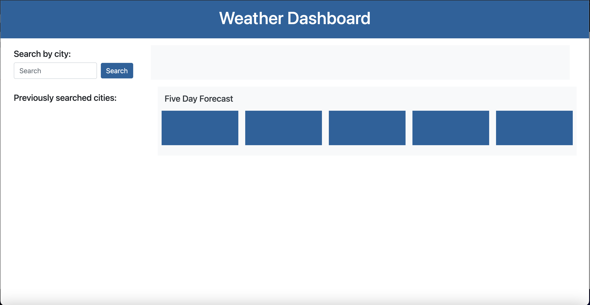
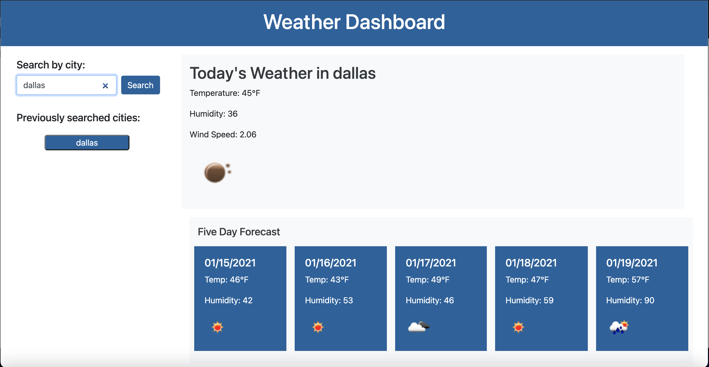
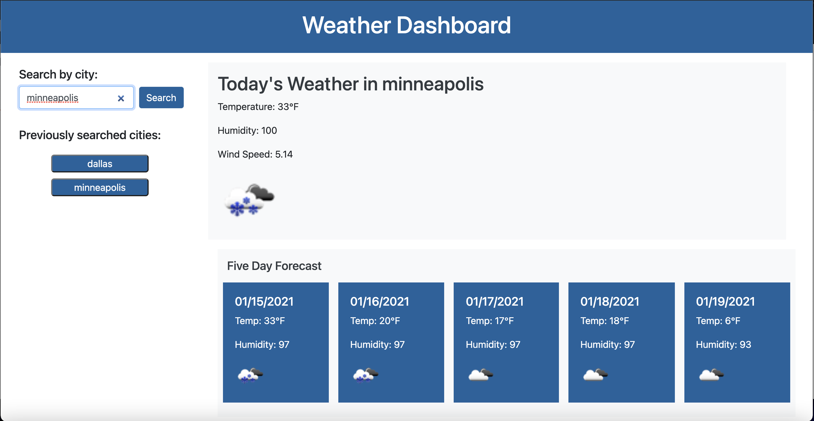

# weather-dashboard
For this assignment we were tasked with building a basic webite that allowed a user to input a search for a specific city to pull up weather data using the Open Weather Map Api then adding it to the HTML to show the user.

Repo Link:
https://github.com/slimeforest/weather-dashboard

Live website link:
https://slimeforest.github.io/weather-dashboard/

Images:

